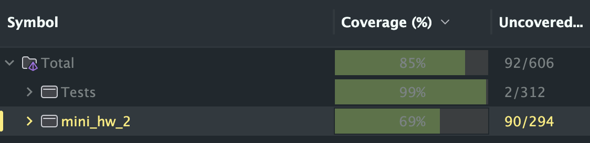

# 🦁 Отчет по проекту "Zoo Management System"

## 📌 1. Цели и требования

Все пункты реализованы в компонентах:

- **Domain**: богатая модель (сущности, Value Objects, Events).
- **Application**: сервисы бизнес-логики и интерфейсы.
- **Infrastructure**: in-memory репозитории.
- **Presentation**: REST API-контроллеры и Swagger.

---

## 📚 2. Применение Domain-Driven Design

1. **Сущности (Entities)**
   - `Animal`, `Enclosure`, `FeedingSchedule` со своими полями и методами (`Feed()`, `MoveTo()`, `Reschedule()`, `MarkAsCompleted()`).
2. **Value Objects**
   - `FavoriteFood`, `EnclosureType`, `HealtStatus`, `NutritionStatus`, `SquareMeters`, `FeedingTime`, `Food`.
   - Они инкапсулируют валидацию и логику (например, `SquareMeters` запрещает не‑положительные значения).
3. **Доменные события**
   - `AnimalMovedEvent` генерируется при переносе животного.
   - `FeedingTimeEvent` публикуется, когда настало время кормления.

Все бизнес-правила инкапсулированы внутри доменных объектов и сервисов.

---

## 🏗 3. Соблюдение Clean Architecture

1. **Слои и зависимости**
   - **Domain** не зависит ни от одного внешнего слоя.
   - **Application** зависит только от Domain (через интерфейсы).
   - **Infrastructure** реализует интерфейсы из Application.
   - **Presentation** зависит от Application и Infrastructure (через DI).
2. **Интерфейсы для взаимодействия**
   - `IRepository<T>`, `IAnimalRepository`, `IEnclosureRepository`, `IFeedingScheduleRepository`, `IAnimalTransferService`, `IFeedingOrganizationService`, `IStatisticsService`, `IEventPublisher`.
3. **Изоляция бизнес-логики**
   - Все контроллеры вызывают сервисы из Application.
   - Сервисы не знают о Presentation и Infrastructure.

---

- В проекте в основном использовался InMemoryRepository, но для соблюдения принципов SOLID, были созданы конкретные реализации, использующие все те же самые методы, но имеющие возможность дополнить интерфейсы.
- Поддерживает **Interface Segregation**: в будущем можно расширить `IAnimalRepository` специфичными методами.

---

## 🚀 5. Запуск 

1. Запусть Program.cs
2. Перейти в браузере на [http://localhost:8080/swagger](http://localhost:8080/swagger).

---

## ✅ 6. Итоги и покрытие

- **Все требуемые кейсы** реализованы и покрыты юнит-тестами (>65% покрытия).
Результаты тестирования:

